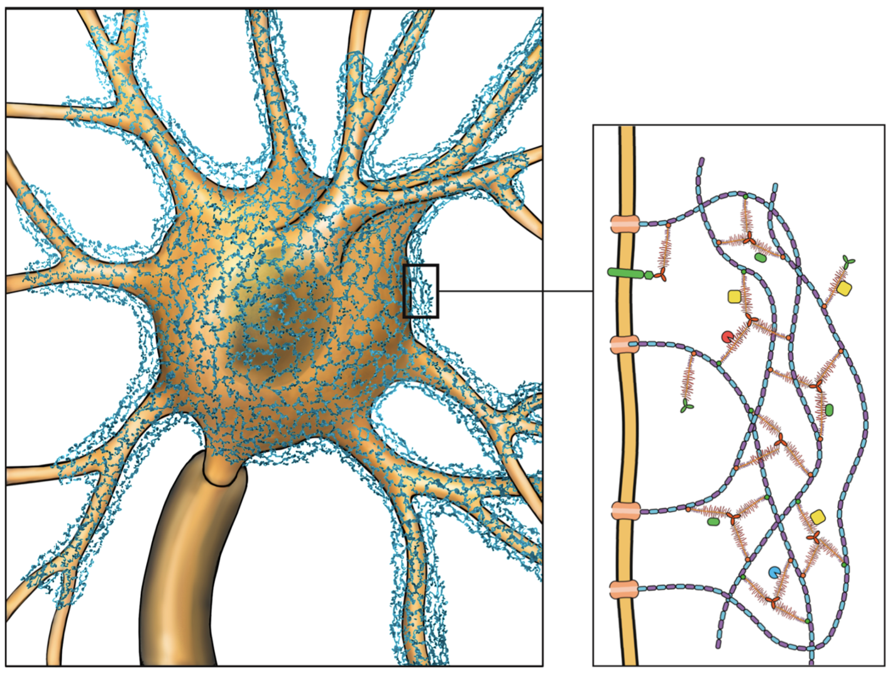

[Odd mesh around a soma that Bethanny found.](https://spelunker.cave-explorer.org/#!%7B%22dimensions%22:%7B%22x%22:%5B4e-9%2C%22m%22%5D%2C%22y%22:%5B4e-9%2C%22m%22%5D%2C%22z%22:%5B4e-8%2C%22m%22%5D%7D%2C%22position%22:%5B288432.53125%2C228665.84375%2C24836.84375%5D%2C%22crossSectionScale%22:0.8991668405617779%2C%22projectionOrientation%22:%5B0.956591010093689%2C0.2067129760980606%2C-0.0009855256648734212%2C-0.20543238520622253%5D%2C%22projectionScale%22:8010.135091432212%2C%22layers%22:%5B%7B%22type%22:%22image%22%2C%22source%22:%22precomputed://https://bossdb-open-data.s3.amazonaws.com/iarpa_microns/minnie/minnie65/em%22%2C%22tab%22:%22source%22%2C%22name%22:%22imagery%22%7D%2C%7B%22type%22:%22segmentation%22%2C%22source%22:%7B%22url%22:%22gs://iarpa_microns/minnie/minnie65/seg_m1300/%7Cneuroglancer-precomputed:%22%2C%22state%22:%7B%22multicut%22:%7B%22sinks%22:%5B%5D%2C%22sources%22:%5B%5D%7D%2C%22merge%22:%7B%22merges%22:%5B%5D%7D%2C%22findPath%22:%7B%7D%7D%7D%2C%22tab%22:%22segments%22%2C%22segments%22:%5B%22864691135338484243%22%2C%22864691135994815946%22%2C%22864691134553950104%22%2C%22864691134981743937%22%2C%22864691134227572540%22%2C%22864691135320252435%22%2C%22864691135366554079%22%2C%22864691134611850222%22%2C%22864691134453269828%22%2C%22864691133659589856%22%2C%22864691134453286212%22%2C%22864691134774734327%22%5D%2C%22colorSeed%22:1630579217%2C%22segmentColors%22:%7B%22864691133659589856%22:%22#ffffff%22%2C%22864691135921089968%22:%22#ffffff%22%2C%22864691135448985172%22:%22#ffffff%22%2C%22864691134774734327%22:%22#ffffff%22%2C%22864691134553950104%22:%22#ffffff%22%2C%22864691135320252435%22:%22#ffffff%22%2C%22864691134611850222%22:%22#f5f5f5%22%2C%22864691134227572540%22:%22#ffffff%22%2C%22864691135338484243%22:%22#ffffff%22%2C%22864691134453269828%22:%22#ffffff%22%2C%22864691134981743937%22:%22#ffffff%22%2C%22864691135366554079%22:%22#ffffff%22%2C%22864691134453286212%22:%22#ffffff%22%2C%22864691135584876141%22:%22#ffffff%22%2C%22864691135504532917%22:%22#ffffff%22%2C%22864691136453720831%22:%22#ffffff%22%7D%2C%22name%22:%22segmentation%22%7D%5D%2C%22showSlices%22:false%2C%22selectedLayer%22:%7B%22size%22:521%2C%22visible%22:true%2C%22layer%22:%22segmentation%22%7D%2C%22layout%22:%223d%22%2C%22selection%22:%7B%22size%22:521%7D%2C%22uiControlVisibility%22:%7B%7D%7D)

Great find! This is something that we have recently been investigating for the first time
in the MICrONS dataset. Your guess of glia makes total sense - the way this object looks 
like a complicated mess of thin sheets (rather than the "tubes" that usually make up neurons) totally matches the look of astrocytes.

[Example of what an astrocyte looks like.](https://spelunker.cave-explorer.org/#!%7B%22dimensions%22:%7B%22x%22:%5B4e-9%2C%22m%22%5D%2C%22y%22:%5B4e-9%2C%22m%22%5D%2C%22z%22:%5B4e-8%2C%22m%22%5D%7D%2C%22position%22:%5B286247.21875%2C223971.671875%2C24740.30859375%5D%2C%22crossSectionScale%22:22.044651706602398%2C%22projectionOrientation%22:%5B0.8470537662506104%2C0.2298980951309204%2C-0.3460075557231903%2C0.3315501809120178%5D%2C%22projectionScale%22:14958.26673298478%2C%22layers%22:%5B%7B%22type%22:%22image%22%2C%22source%22:%22precomputed://https://bossdb-open-data.s3.amazonaws.com/iarpa_microns/minnie/minnie65/em%22%2C%22tab%22:%22source%22%2C%22name%22:%22imagery%22%7D%2C%7B%22type%22:%22segmentation%22%2C%22source%22:%7B%22url%22:%22gs://iarpa_microns/minnie/minnie65/seg_m1300/%7Cneuroglancer-precomputed:%22%2C%22state%22:%7B%22multicut%22:%7B%22sinks%22:%5B%5D%2C%22sources%22:%5B%5D%7D%2C%22merge%22:%7B%22merges%22:%5B%5D%7D%2C%22findPath%22:%7B%7D%7D%7D%2C%22tab%22:%22segments%22%2C%22segments%22:%5B%22864691135307097158%22%5D%2C%22colorSeed%22:1630579217%2C%22segmentColors%22:%7B%22864691135584876141%22:%22#ffffff%22%2C%22864691134553950104%22:%22#ffffff%22%2C%22864691134227572540%22:%22#ffffff%22%2C%22864691134611850222%22:%22#f5f5f5%22%2C%22864691134774734327%22:%22#ffffff%22%2C%22864691135320252435%22:%22#ffffff%22%2C%22864691135921089968%22:%22#ffffff%22%2C%22864691135448985172%22:%22#ffffff%22%2C%22864691136453720831%22:%22#ffffff%22%2C%22864691134453269828%22:%22#ffffff%22%2C%22864691133659589856%22:%22#ffffff%22%2C%22864691134981743937%22:%22#ffffff%22%2C%22864691135504532917%22:%22#ffffff%22%2C%22864691135338484243%22:%22#ffffff%22%2C%22864691135366554079%22:%22#ffffff%22%2C%22864691134453286212%22:%22#ffffff%22%7D%2C%22name%22:%22segmentation%22%7D%5D%2C%22showAxisLines%22:false%2C%22showSlices%22:false%2C%22selectedLayer%22:%7B%22size%22:259%2C%22visible%22:true%2C%22layer%22:%22segmentation%22%7D%2C%22layout%22:%223d%22%2C%22settingsPanel%22:%7B%22visible%22:true%7D%2C%22selection%22:%7B%22size%22:259%7D%2C%22uiControlVisibility%22:%7B%7D%7D)

However, one clue for this object is when we look at the raw EM imagery

[Object in blue has almost nothing inside it - easier to see if you open the link yourself!](https://spelunker.cave-explorer.org/#!%7B%22dimensions%22:%7B%22x%22:%5B4e-9%2C%22m%22%5D%2C%22y%22:%5B4e-9%2C%22m%22%5D%2C%22z%22:%5B4e-8%2C%22m%22%5D%7D%2C%22position%22:%5B287010.03125%2C228925.28125%2C24818.5%5D%2C%22crossSectionScale%22:0.5077249176954219%2C%22projectionOrientation%22:%5B0.94384765625%2C0.22425851225852966%2C-0.006371091119945049%2C-0.2425266057252884%5D%2C%22projectionScale%22:8010.135091432212%2C%22layers%22:%5B%7B%22type%22:%22image%22%2C%22source%22:%22precomputed://https://bossdb-open-data.s3.amazonaws.com/iarpa_microns/minnie/minnie65/em%22%2C%22tab%22:%22annotations%22%2C%22shaderControls%22:%7B%22normalized%22:%7B%22range%22:%5B103%2C155%5D%2C%22window%22:%5B90%2C168%5D%7D%7D%2C%22name%22:%22imagery%22%7D%2C%7B%22type%22:%22segmentation%22%2C%22source%22:%7B%22url%22:%22gs://iarpa_microns/minnie/minnie65/seg_m1300/%7Cneuroglancer-precomputed:%22%2C%22state%22:%7B%22multicut%22:%7B%22sinks%22:%5B%5D%2C%22sources%22:%5B%5D%7D%2C%22merge%22:%7B%22merges%22:%5B%5D%7D%2C%22findPath%22:%7B%7D%7D%7D%2C%22tab%22:%22segments%22%2C%22segments%22:%5B%22864691135994815946%22%2C%22864691134553950104%22%2C%22864691136453720831%22%2C%22864691134981743937%22%2C%22864691134227572540%22%2C%22864691135320252435%22%2C%22864691135448985172%22%2C%22864691135504532917%22%2C%22864691135921089968%22%2C%22864691135366554079%22%2C%22864691134611850222%22%2C%22864691135584876141%22%2C%22864691134453269828%22%2C%22864691133659589856%22%2C%22864691134453286212%22%2C%22864691134774734327%22%2C%22864691134774885623%22%5D%2C%22colorSeed%22:1630579217%2C%22segmentColors%22:%7B%22864691135366554079%22:%22#ffffff%22%2C%22864691134611850222%22:%22#f5f5f5%22%2C%22864691134453286212%22:%22#ffffff%22%2C%22864691134981743937%22:%22#ffffff%22%2C%22864691135448985172%22:%22#ffffff%22%2C%22864691135584876141%22:%22#ffffff%22%2C%22864691134227572540%22:%22#ffffff%22%2C%22864691136453720831%22:%22#ffffff%22%2C%22864691135921089968%22:%22#ffffff%22%2C%22864691134453269828%22:%22#ffffff%22%2C%22864691134553950104%22:%22#ffffff%22%2C%22864691133659589856%22:%22#ffffff%22%2C%22864691134774734327%22:%22#ffffff%22%2C%22864691135504532917%22:%22#ffffff%22%2C%22864691135338484243%22:%22#9e0000%22%2C%22864691134774885623%22:%22#19d7c0%22%2C%22864691135320252435%22:%22#42c3cd%22%7D%2C%22name%22:%22segmentation%22%7D%5D%2C%22showSlices%22:false%2C%22selectedLayer%22:%7B%22size%22:259%2C%22visible%22:true%2C%22layer%22:%22segmentation%22%7D%2C%22layout%22:%22xy%22%2C%22selection%22:%7B%22size%22:259%7D%2C%22uiControlVisibility%22:%7B%7D%7D)

If we look at the imagery for the object shown in blue (part of this mesh around the soma) what you'll notice is that there is almost nothing inside of it. Definitely no mitochondria or other organelles that would be common in any cell, even an astrocyte. That gives a clue that this might not actually be part of a cell at all!

If it's not a cell, what is it? We think this object is actually part of the [extracellular matrix](https://en.wikipedia.org/wiki/Extracellular_matrix), and more specifically, is something known as a **perineuronal net (PNN)**.

Note how much it resembles the diagram in this picture from @auer2025role:

The same paper describes how pernieuronal nets specifically target specific cell types such as inhibitory parvalbumin-expressing (PV) cells - which is exactly the cell type of the neuron that this PNN is surrounding based on its general morphology (how do we know? that could be the topic of another blog post...).

Why do these nets exist? Perineuronal nets are thought to play a role in processes like synaptic plasticity [@auer2025role] and may actually be involved in helping to buffer ions around the soma of cells, which may explain why they are preferentially found around so-called "fast spiking" PV cells which have a lot of ionic work to do [@hartig1999cortical]. 

We are actually looking into better characterizing these structures in the MICrONS dataset - stay tuned! 

